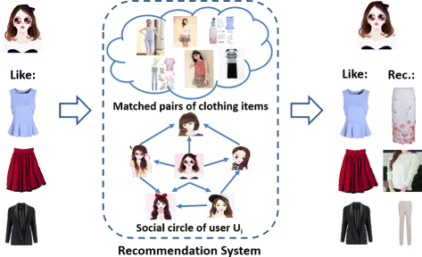

# Clothing-Recommendation-System

This project is a proposed solution that
aims to improve customer shopping enthusiasm
and online shopping experiences. This report
details and explains the model used for
recommending shop items that users have a high
possibility to purchase and the comparison
between several approaches to recommendation.
The experimental results show that by
measuring user similarity, specifically between
purchase and rating history, one is able to more
precisely predict user ratings for items that have
not yet been purchased by the user and
coincidentally curate a list of (new) items that
the user is highly likely to purchase and rate
high. Results from this study are not limited to the
fashion industry alone. The models can be used
in many other industries where user-item ratings
are available and rating predictions could
influence item recommendation to the users.

## Dataset

The dataset used contains the measurements of
clothing fit from RentTheRunway. The data is
cited from the report called Decomposing fit
semantics for product size recommendation in
metric spaces by Rishabh Misra, Mengting Wan,
Julian McAuley RecSys, 2018. This dataset contains a total of 192,544 example
vectors and aside from body measurements such
as bus size, height, and weight, it also includes
the text feedback (review_text), review date
from each item’s purchase/rental, and finally the
rating given to the item by the user on a scale of
1-10.

## Models Comparison
- Jaccard Similarity\
- Bag of Words (Cosine)\
- TF-IDF (Cosine)\
- Item2Vec

### Collaborators
Shunsuke Iwata\
Mao-Ho Wang\
Yada Klueabvichit\
Andrew Santos
